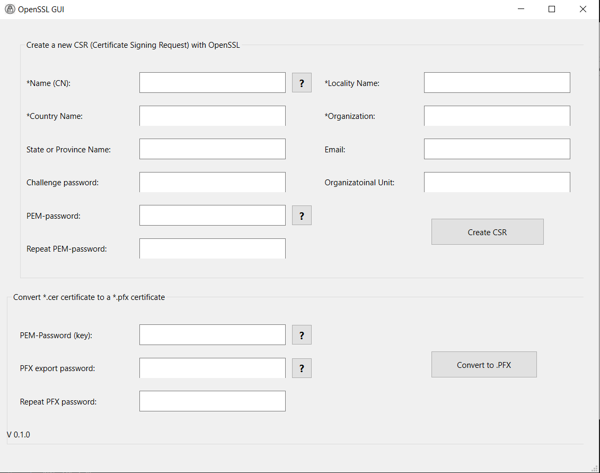
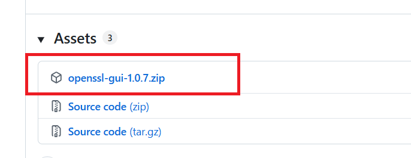
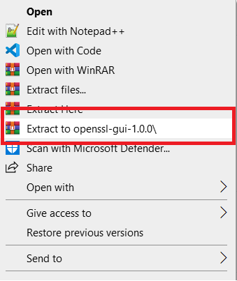

# OpenSSL GUI App

A lightweight **GUI application** for OpenSSL, designed to simplify certificate operations.  

  

---

## Table of Contents
- [OpenSSL GUI App](#openssl-gui-app)
  - [Table of Contents](#table-of-contents)
  - [Features](#features)
  - [Screenshots](#screenshots)
  - [⬇Download](#download)
  - [Usage](#usage)
    - [Create a CSR](#create-a-csr)
    - [Convert CSR to P12](#convert-csr-to-p12)
  - [📄 License](#-license)

---

## Features
- **Create CSR** – Easily generate Certificate Signing Requests via GUI.  
- **Convert CSR to P12** – Transform CSRs into P12 (PKCS#12) certificates for secure use.  

---

## Screenshots
  

---

## ⬇Download
1. Go to the [Releases page](https://github.com/muazem7/openssl-gui/releases)  
2. Download the latest `.zip` release under assets
3. Extract the zip file anywhere on your computer
4. Launch the application by opening the executable `openssl-gui.exe`

  

---

## Usage

### Create a CSR
1. Open the app  
2. Navigate to **Create CSR**  
3. Fill in your certificate details (Common Name, Organization, etc.)  
4. Click **Generate**  
5. Save the CSR  

### Convert CSR to P12
1. Open **Convert CSR to P12**  
2. Select your CSR file and provide necessary details (private key, password, etc.)  
3. Click **Convert**  
4. Save the resulting `.p12` file  

---

## 📄 License
This project is licensed under the MIT License. See [LICENSE](LICENSE) for details.
